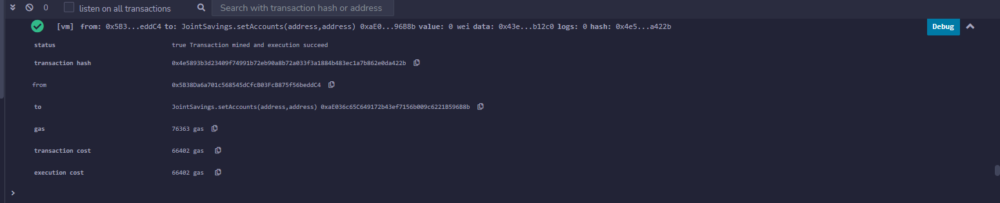
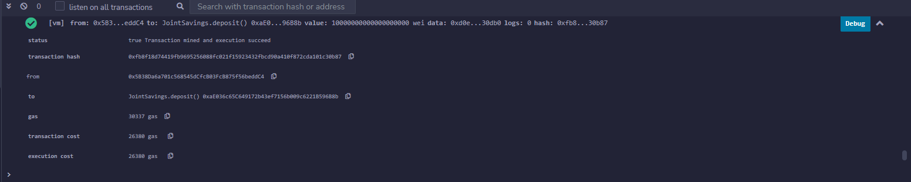
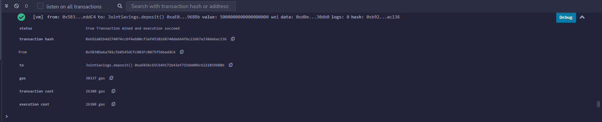
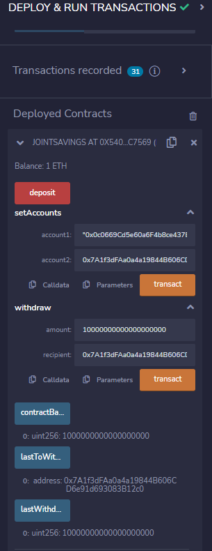
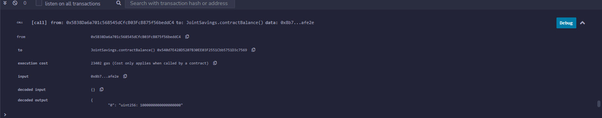

# Joint Savings in solidity

## Introduction
Using solidity to create a smart contract that accepts two user addresses and combines them into a joint savings account.

## Summary
To automate the creation of joint savings accounts, you’ll create a Solidity smart contract that accepts two user addresses. These addresses will be able to control a joint savings account. Your smart contract will use ether management functions to implement a financial institution’s requirements for providing the features of the joint savings account. These features will consist of the ability to deposit and withdraw funds from the account.

## Installation Guide
head to the remix IDE website https://remix.ethereum.org/

# showing working smart contract

# sending 1 ether as wei

# sending 10 ether as wei

# sending 5 ether 

# Last to withdraw and last withdraw functions

# Showing remaining Wei in account after all transactions

